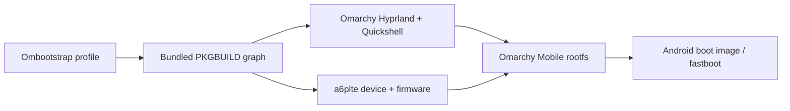

# Ombootstrap

Ombootstrap (`ombs`) builds Arch-based mobile images for Android devices.
It keeps the original Kupfer boot and kernel pipeline, while the default
profile targets the **Omarchy Mobile** flavour: Hyprland is taken from the
Omarchy AArch64 tree and the status bar, notifications and launcher are
provided by Omarchy Quickshell.

The bundled package graph includes the Omarchy sources
[omarchy-aarch64](https://github.com/riverscn/omarchy-aarch64) and
[omarchy-pkgs-aarch64](https://github.com/riverscn/omarchy-pkgs-aarch64), plus
the Samsung A6+ (`msm8953-a6plte`) device and firmware recipes adapted from
[pkgbuilds-msm8953](https://gitlab.com/legengemini/pkgbuilds-msm8953).
Recipes are copied to the user cache on first use and local edits are kept.

## Install

On an Arch-based host install Python, `makepkg`, `pacstrap`, Git and the
cross-toolchain (`base-devel` and `arch-install-scripts` provide the Arch
packaging commands). Docker is optional; the generated config uses the host
toolchain by default.

```sh
python3 -m venv venv
venv/bin/pip install -e .
venv/bin/ombs --help
```

For a system-wide shell command:

```sh
ln -s "$(pwd)/venv/bin/ombs" ~/.local/bin/ombs
```

## Build the default phone image

```sh
ombs image build
```

On the first build, `ombs` creates the default config and asks only for the
target device. The Omarchy Mobile flavour and remaining profile values use
defaults.

The generated profile is:

```text
device:   msm8953-a6plte
flavour:  omarchy-mobile
hostname: omarchy-phone
user:     omarchy
```

To use the Docker wrapper explicitly, set `wrapper.type = "docker"` in
`~/.config/ombootstrap/ombootstrap.toml`.

Change it with `ombs config` or by editing
`~/.config/ombootstrap/ombootstrap.toml`. The build graph is:



## Mobile session

`ombootstrap-mobile-config` layers the mobile changes on top of the Omarchy
Lua configuration:

- `XF86PowerOff` toggles DPMS and the touchscreen together.
- Volume Down toggles `wvkbd-mobintl -l simple,specialpad -H 160`.
- Volume Up opens `omarchy-menu toggle apps`.
- Swiping from an outer edge changes workspaces; outer gaps are 20.
- The Quickshell bar supplies audio, brightness, notifications, lock and
  application controls. Set `BACKLIGHT_DEVICE` in
  `~/.config/ombootstrap/mobile.conf` when automatic `brightnessctl`
  discovery is not sufficient.
- The DSI panel defaults to scale `2.66666`; the configuration disables direct
  scanout and sets `GSK_RENDERER=ngl` for the requested graphics workarounds.
- The WVKBD layer is allowed above the Hyprland lock screen.

Only Hyprland and its Omarchy integration are imported from Omarchy. Boot,
kernel, device and firmware handling remains in the Ombootstrap package graph.

## Development

Run formatting and focused tests with:

```sh
python3 scripts/format-pkgbuilds.py --check
ombs packages check all
venv/bin/ruff check
venv/bin/pytest -q -k 'not integration and not root'
```

The original Kupfer repository is kept as the `upstream` Git remote for
history and compatibility. The forked user-facing project and command are
Ombootstrap and `ombs`.
