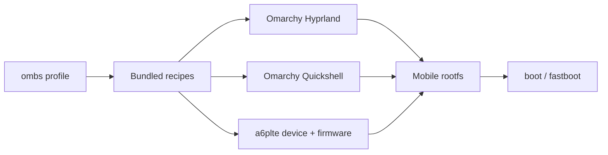

# Ombootstrap Documentation

This is the documentation for [Ombootstrap](https://gitlab.com/ombootstrap/ombootstrap),
the image and package builder for Arch-based Android devices. The default
profile builds the Omarchy Mobile Hyprland session for the Samsung A6+
(`msm8953-a6plte`).

The package graph keeps the Android boot, kernel, device and firmware layers
from Kupfer and adds the Omarchy AArch64 runtime and Quickshell shell.

Documentation pages:

`ombs` is the only user-facing command name; the old Kupfer module names
remain internally where the boot package format requires them.
